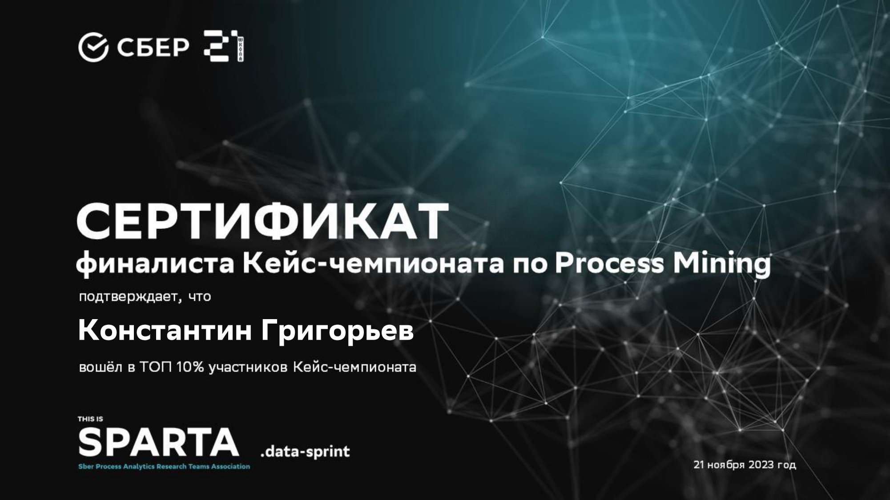
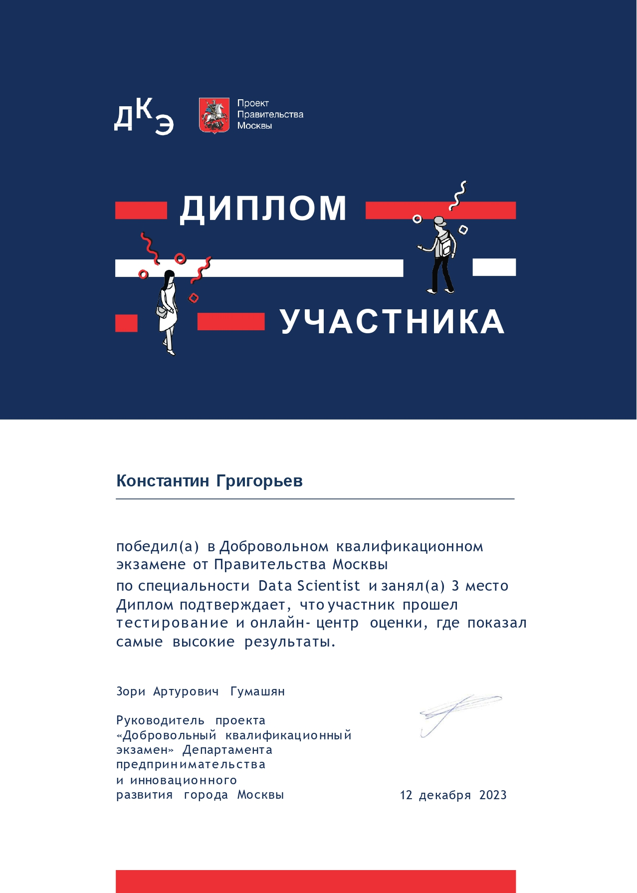
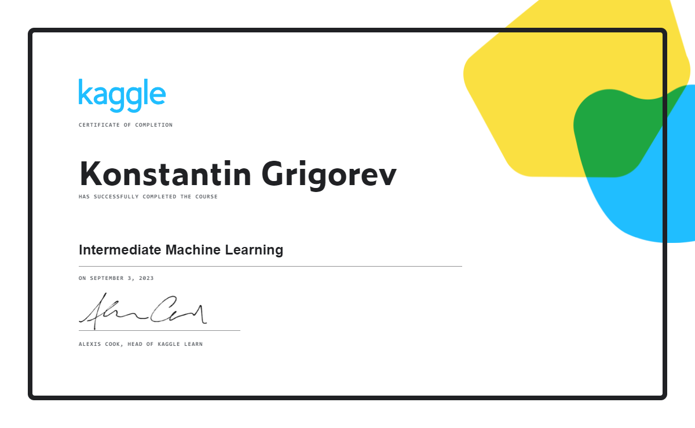
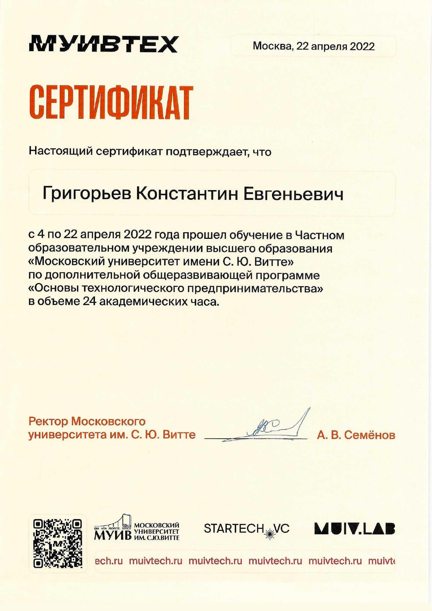

# Портфолио
Привет!  
Меня зовут Константин Григорьев, я развиваюсь в направлении Data Science.  
**Содержание**  
- [Портфолио](#портфолио)
  - [Образование](#образование)
      - [Курсы и тренинги](#курсы-и-тренинги)
      - [Дополнительная информация](#дополнительная-информация)
      - [Резюме](#резюме)
  - [Стек технологий](#стек-технологий)
  - [Выполненные проекты](#выполненные-проекты)
      - [2022: Ознакомительная практика в ФКУ «ГосТех»](#2022-ознакомительная-практика-в-фку-гостех)
      - [2023: Курсовая работа](#2023-курсовая-работа)
      - [2023: Практическая работа](#2023-практическая-работа)
      - [2023: Pet-проект](#2023-pet-проект)
      - [Некоторые проекты, выполненные во время обучения в "Школе 21"](#некоторые-проекты-выполненные-во-время-обучения-в-школе-21)
  - [Дипломы и сертификаты](#дипломы-и-сертификаты)
    - [Сертификат финалиста This is SPARTA data.sprint](#сертификат-финалиста-this-is-sparta-datasprint)
    - [Диплом победителя ДКЭ 2023 по специальности Data Science](#диплом-победителя-дкэ-2023-по-специальности-data-science)
    - [Сертификат прохождения курса Kaggle "Intermediate Machine Learning"](#сертификат-прохождения-курса-kaggle-intermediate-machine-learning)
    - [Сертификат прохождения курса МУИВТЕХ "Основы технологического предпринимательства"](#сертификат-прохождения-курса-муивтех-основы-технологического-предпринимательства)

## Образование
- Обучаюсь на 3-ем курсе бакалавриата МУИВ. Факультет информационных технологий.  
- С октября 2023-го года прохожу обучение в АНО "Школа 21", образовательном проекте от Сбера для разработчиков, бывшем филиале школы 42.  

#### Курсы и тренинги
- 2022 ЧОУВО “МУ ИМ. С. Ю. ВИТТЕ”, “Основы технологического предпринимательства” 24 ак. ч.
- 2022 МФТИ, “Быстрый старт в искусственный интеллект” 45 ак. ч.
- 2023 Правительство Москвы, Добровольный Квалификационный Экзамен по Data Science.  

#### Дополнительная информация
- Английский язык, B2

#### Резюме
Резюме можно увидеть по <a href="https://docs.google.com/document/d/1dGomIFwV9CrbjELwAdm7i6G82fdemjrJ7BARTZvZYPo/edit?usp=sharing">ссылке</a>.
## Стек технологий 
- **Программирование**: Python, C, SQL;
- **­Базы данных**: PostgreSQL, MySQL, SQLite;
- **­Машинное обучение**: Scikit-learn, Tensorflow, PyTorch, CatBoost, XGBoost;
- **­Визуализация данных**: Matplotlib, Seaborn;
- **­Обработка данных**: NumPy, Pandas;
- **Веб-разработка**: HTML, CSS, Flask;
- **­Операционные системы**: Windows, Linux, MacOS;
- **­А также**: регулярные выражения, Beautiful Soup, Tkinter, Docker, Git, Bash, Excel, SSH, сети.  
## Выполненные проекты
В основном выполнял проекты, связанные с анализом данных и классическим машинным обучением.  
___
#### 2022: Ознакомительная практика в ФКУ «ГосТех»
**“Разработка сценариев реализации угроз с использованием MITRE ATT&CK на примере цифровой подстанции. Рассмотрение вопросов автоматизации процесса формирования сценариев угроз”**  

___
#### 2023: Курсовая работа
**“Интерактивное приложение для доступа к ML-моделям с сервера”**  
<a href="https://github.com/Skupydoom/portfolio/tree/main/source/Интерактивное%20приложение%20для%20доступа%20к%20ML-моделям%20с%20сервера">Ссылка</a> на исходный код.  
**Задачи**:  
- Клиент-серверное приложение с авторизацией.
- Используемые технологии: 
- Работа с базами данных.
- Система авторизации пользователей.
- Сетевое взаимодействие.
- Python, CustomTkinter, Tkinter, Flask, Requests, Sqlite3.
- SQL.

**Результаты**:  
- Готовое приложение с возможностью авторизации и получения внутренней информации.
- Значительно улучшил навыки разработки бэкенд части приложений на Python.

**Описание:**  
Проект представляет собой клиент-серверное приложение. Сервер может быть запущен исполнением скрипта ./server/server.py.  
Графический интерфейс запускается скриптом ./client/main.py.  
Пользователя встречает следующее окно регистрации:  

<table>
  <tr>
    <td>
        </img>
    </td>
    <td>
        </img>
    </td>
  </tr>
</table>

После введения данных и нажатия кнопки регистрации происходит передача данных серверу, запись в базу данных пользователей:  
</img>

В случае успешной записи идёт перенаправление на основное окно:  
<table>
  <tr>
    <td>
        </img>
    </td>
    <td>
        </img>
    </td>
  </tr>
</table>

Здесь человек может выбрать понравившуюся модель из списка и получить описание.  
Также реализован вход по логину и паролю:  
</img>

Есть кнопка переадресации со страницы логина на страницу регистрации и наоборот.  
Тема может быть изменена на тёмную или системную при её выборе из списка:  
</img>

Клиент и сервер показывают в консоли отладочную информацию при различных действиях пользователей:  
<table>
  <tr>
    <td>
        </img>
    </td>
    <td>
        </img>
    </td>
  </tr>
</table>

___
#### 2023: Практическая работа
**“Анализ данных аэропортов, визуализация и применение машинного обучения для проверки наличия регулярных рейсов”**

___
#### 2023: Pet-проект
**“Students Adaptability ML”**

___
#### Некоторые проекты, выполненные во время обучения в "Школе 21"  
- Реализация оригинальной игры "Понг" на языке C.
- Реализация клеточного автомата "Game Of Life" на языке C.
- Реализация Bash утилит Cat и Grep.
- Реализация библиотеки C string.h с дополнительным функционалом.
- Базовое ознакомление с Linux (Ubuntu Server LTS 20.04).
- Настройка сети на виртуальных машинах с Linux и их взаимодействие.
___
## Дипломы и сертификаты
### Сертификат финалиста This is SPARTA data.sprint
</img>

### Диплом победителя ДКЭ 2023 по специальности Data Science
</img>

### Сертификат прохождения курса Kaggle "Intermediate Machine Learning"
</img>

### Сертификат прохождения курса МУИВТЕХ "Основы технологического предпринимательства"
</img>